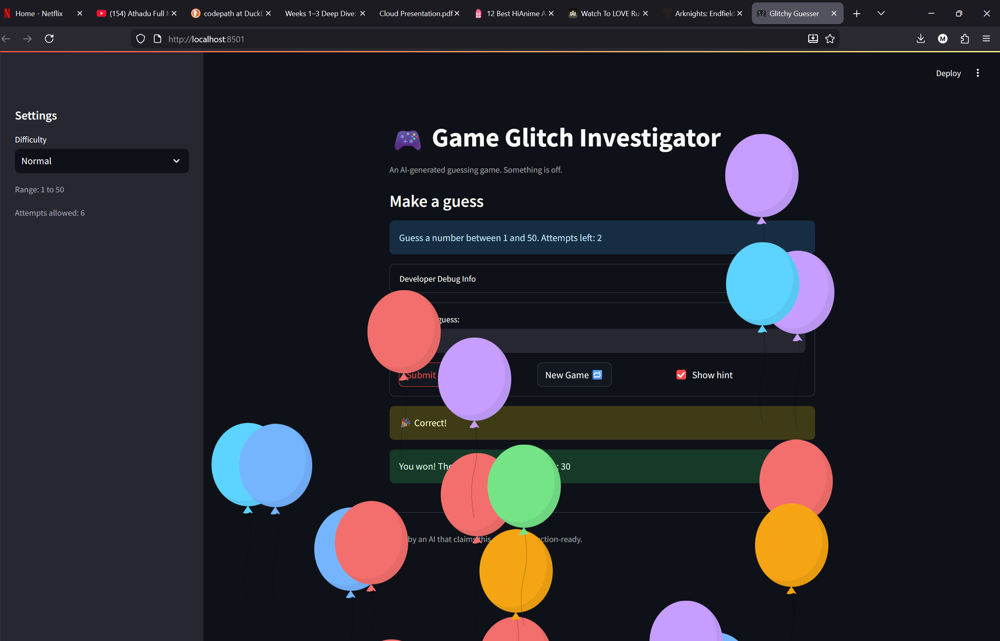

# 🎮 Game Glitch Investigator: The Impossible Guesser

## 🚨 The Situation

You asked an AI to build a simple "Number Guessing Game" using Streamlit.
It wrote the code, ran away, and now the game is unplayable. 

- You can't win.
- The hints lie to you.
- The secret number seems to have commitment issues.

## 🛠️ Setup

1. Install dependencies: `pip install -r requirements.txt`
2. Run the broken app: `python -m streamlit run app.py`

## 🕵️‍♂️ Your Mission

1. **Play the game.** Open the "Developer Debug Info" tab in the app to see the secret number. Try to win.
2. **Find the State Bug.** Why does the secret number change every time you click "Submit"? Ask ChatGPT: *"How do I keep a variable from resetting in Streamlit when I click a button?"*
3. **Fix the Logic.** The hints ("Higher/Lower") are wrong. Fix them.
4. **Refactor & Test.** - Move the logic into `logic_utils.py`.
   - Run `pytest` in your terminal.
   - Keep fixing until all tests pass!

## 📝 Document Your Experience

- [ ] Describe the game's purpose.
   The purpose of this game is to let the user guess a secret number based on the selected difficulty level. The app gives hints after each valid guess to tell the player whether to go higher or lower. It also keeps track of attempts, score, and guess history using Streamlit session state.
- [ ] Detail which bugs you found.
   I found several bugs when I started testing the game. The hint logic was incorrect, the difficulty ranges were mixed up, and the attempts started at 1 instead of 0. The New Game button did not fully reset the game state, and changing the difficulty did not properly reset the secret number and related values. I also found a submit issue where entering a second guess sometimes did not behave correctly, which was related to how Streamlit reruns and widget state were being handled.
- [ ] Explain what fixes you applied.
   I fixed the guessing logic so the hints finally matched whether my guess was too high or too low. I also corrected the difficulty ranges, the attempt counter, and the reset behavior so the game would work properly when I started a new game or changed the difficulty. After that, I updated the submit flow using a Streamlit form because the second guess was sometimes not being picked up correctly. I also added a check for out-of-range guesses so the app shows a clear error instead of treating those inputs like normal guesses.
## 📸 Demo

- [ ] 

## 🚀 Stretch Features

- [ ] [If you choose to complete Challenge 4, insert a screenshot of your Enhanced Game UI here]
